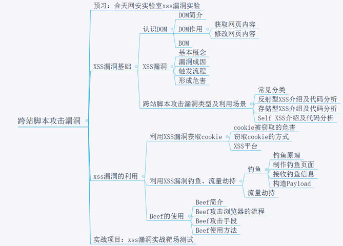

##   第25天 xss跨站注入 


***XSS跨站之原理分类及攻击手法***

## 1.原理

### 漏洞产生的原理（本质 ）

`js脚本`代码 

前端方面    、    函数类型

浏览器内核版本不同，产生差异

xss 要防止过滤


## 2. 分类 ###

- 反射型（持续型）
- 存储型（非持续型）
- DOM型


### 1.反射型 ##


```javascript
<script>alert(1)</script>
```


	#`onclick="alert(2)">


### 2.存储型  ##


### 3.DOM型

dom树


触发地址链接


是一种特殊的反射型

值的

## 3.区别 ##

#### 反射型

1. 发包

2. 传参

到php
然后回包

#### 存储型

1. 发包 
   传参
2. 
   写入数据库里的表

3. 数据写入数据库
4. 回显

#### dom型


1. 发包    存储到本地的静态前端代码    前端的js处理完毕

​    **在js代码端处理**


后端的php不处理

（文件上传的js过滤）

与后端的数据库无关

网页传参
带入执行


后端语言处理

dom型是js的
代码处理


dom属于一种反射型


<hr>

使用跨站脚本控制页面显示的内容

跨站语句


## 4.cookie

cookie

**用户的凭据**；通过凭据判断对方身份

保存cookie的时间
（管理员的cookie）

+ 对方有bug
+ 浏览器没阻止
+ 未登陆后台
+ 浏览器未保存
+ 对方的保护（代码过滤，http-only)
+ 对方不触发bug
+         

###### session 

+ 存储服务器  
+ 存活的时间较短
+ 大型的项目
+ 较为安全


###### cookie

+ 存储在本地

+ 存活的时间长
+ 小中型


session失效


`sqli-libs cookie注入`


## 5.实例 ##


绕过script过滤

	<BOOY onload="alert('xss')">


盗取cookie

登录管理员页面

啊

#### xss平台


**
分类
**


**
手法
**



